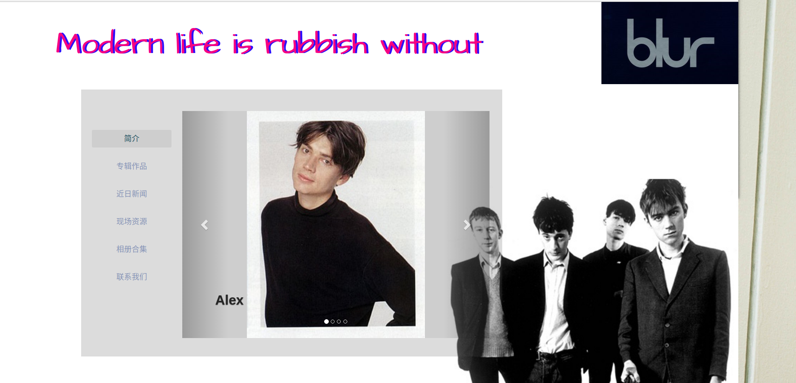

## HTML静态页面

[github传送门](https://github.com/cramonDE/htmlDEMO "传送门")
[预览地址](http://cramon.tk/webpack/build/index.html "预览地址")
主要功能是实现了一个乐队**BULR**相关的乐队成员信息和相关的音乐资讯
### 使用的框架
- bootstrap相关的样式以及跑马灯插件
- wow.js 实现动态效果

### 细节
 前面主要是应用了发布的一个相关的webpack的打包的模板,之后发现对webpack对第三方库的引入比较不方便,后面就仅仅是当作达标css和js相关的工具,以及动态检测修改html以及自动刷新
